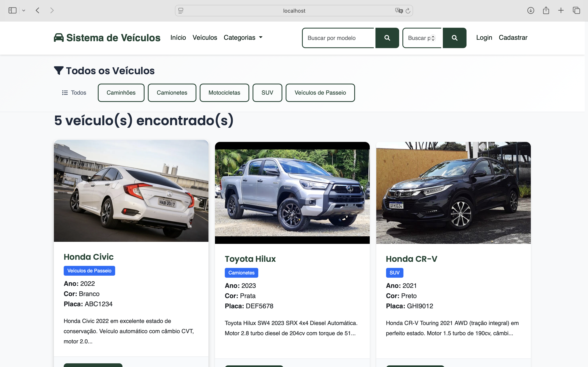
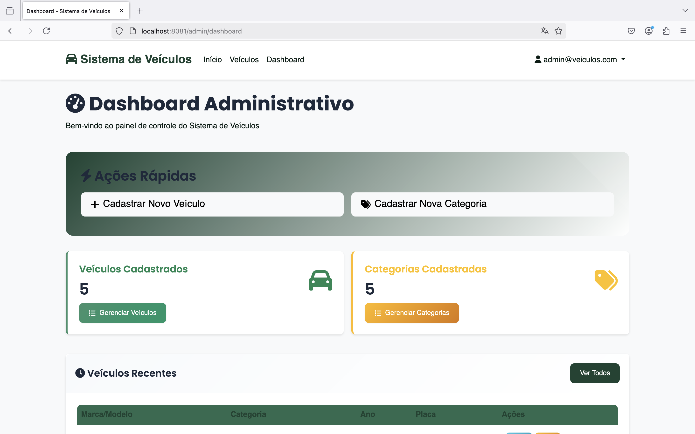
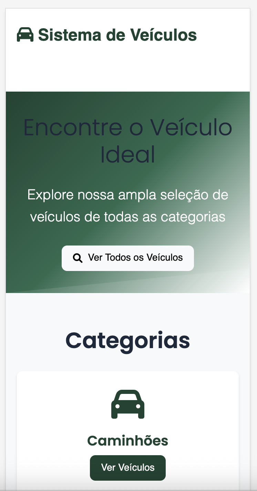

# Autos Gestión

Sistema de gestión de vehículos desarrollado con Spring Boot y Thymeleaf.

## 🎥 Demostración en Video

Puedes ver una demostración completa del sistema en el siguiente video:

[](https://youtu.be/4KaF-Pn03ZE)

## 🚀 Tecnologías Utilizadas

### Backend
- Java 17
- Spring Boot 3.2.3
- Spring Security
- Spring Data JPA
- Hibernate
- H2 Database (desarrollo)

### Frontend
- Thymeleaf
- Bootstrap 5.3.0
- jQuery 3.7.0
- Font Awesome 6.0.0
- Google Fonts (Roboto)

## 📋 Características Principales

### Gestión de Vehículos
- Registro de vehículos con información detallada
- Categorización de vehículos
- Búsqueda avanzada
- Gestión de estado (disponible, no disponible, en mantenimiento)

### Administración
- Panel de control administrativo
- Gestión de usuarios y roles
- Estadísticas del sistema
- Configuración del sistema

### Seguridad
- Autenticación de usuarios
- Autorización basada en roles
- Protección contra ataques comunes
- Sesiones seguras

### Internacionalización
- Interfaz en español
- Soporte para múltiples idiomas
- Mensajes personalizados

## 🛠️ Configuración del Proyecto

### Requisitos Previos
- Java 17 o superior
- Maven 3.6 o superior
- IDE compatible con Spring Boot (recomendado: IntelliJ IDEA o Eclipse)

### Instalación
1. Clonar el repositorio:
```bash
git clone [URL_DEL_REPOSITORIO]
```

2. Navegar al directorio del proyecto:
```bash
cd autos-gestion
```

3. Compilar el proyecto:
```bash
mvn clean install
```

4. Ejecutar la aplicación:
```bash
mvn spring-boot:run
```

### Configuración
El archivo `application.properties` contiene las siguientes configuraciones principales:

- Base de datos H2 (desarrollo)
- Configuración de seguridad
- Internacionalización
- Configuración del servidor
- Configuración de Thymeleaf

## 📁 Estructura del Proyecto

```
src/
├── main/
│   ├── java/
│   │   └── com/veiculos/
│   │       ├── config/
│   │       ├── controller/
│   │       ├── model/
│   │       ├── repository/
│   │       ├── service/
│   │       └── SistemaVeiculosApplication.java
│   └── resources/
│       ├── static/
│       │   ├── css/
│       │   ├── js/
│       │   └── images/
│       ├── templates/
│       │   ├── layout/
│       │   ├── admin/
│       │   ├── auth/
│       │   └── vehicle/
│       ├── messages_es.properties
│       └── application.properties
└── test/
```

## 👥 Equipo de Desarrollo

### Desarrolladores
- **Alan Canto**
  - LinkedIn: [Alan Canto](https://www.linkedin.com/in/alancanto/)
  - Rol: Desarrollador Junior
  - Estudiante de TADS - IFSul Campus Santana do Livramento

- **Walter Ramos**
  - Rol: Desarrollador Junior
  - Estudiante de TADS - IFSul Campus Santana do Livramento

- **Ignacio Piñeyro**
  - Rol: Desarrollador Junior
  - Estudiante de TADS - IFSul Campus Santana do Livramento

## 🔒 Seguridad

El sistema implementa las siguientes medidas de seguridad:

- Autenticación basada en Spring Security
- Protección contra CSRF
- Headers de seguridad
- Cookies seguras
- Validación de entrada de datos
- Sanitización de datos

## 🌐 Internacionalización

El sistema está completamente traducido al español y preparado para soportar múltiples idiomas:

- Mensajes en español en `messages_es.properties`
- Soporte UTF-8
- Configuración de locale

## 🎨 Diseño

El sistema utiliza un diseño moderno y responsivo con:

- Esquema de colores personalizado
- Diseño adaptativo para móviles
- Animaciones suaves
- Iconografía consistente
- Tipografía optimizada

## 📱 Características Responsivas

- Diseño adaptable a diferentes dispositivos
- Menú hamburguesa para móviles
- Imágenes optimizadas
- Controles táctiles mejorados

## 🔄 Flujo de Trabajo

1. **Autenticación**
   - Login/Registro de usuarios
   - Recuperación de contraseña

2. **Gestión de Vehículos**
   - Registro de vehículos
   - Actualización de información
   - Eliminación de registros

3. **Administración**
   - Panel de control
   - Gestión de usuarios
   - Configuración del sistema

## 📈 Próximas Mejoras

- Implementación de pruebas automatizadas
- Integración con sistemas de pago
- API REST para integración con otros sistemas
- Dashboard con gráficos y estadísticas
- Sistema de notificaciones

## 📄 Licencia

Este proyecto está bajo la Licencia MIT. Ver el archivo `LICENSE` para más detalles.

## 🤝 Contribución

Las contribuciones son bienvenidas. Por favor, lea `CONTRIBUTING.md` para detalles sobre nuestro código de conducta y el proceso para enviarnos pull requests.

## 📞 Soporte

Para soporte, por favor contacte al equipo de desarrollo o abra un issue en el repositorio.

## 📸 Capturas de Pantalla

### Interfaz Principal

*Panel principal del sistema con vista general de vehículos*

### Gestión de Vehículos

*Interfaz de gestión de vehículos con opciones de filtrado y búsqueda*

### Panel de Administración

*Panel de control administrativo con estadísticas y configuración*

### Vista Móvil

*Vista adaptativa para dispositivos móviles* 